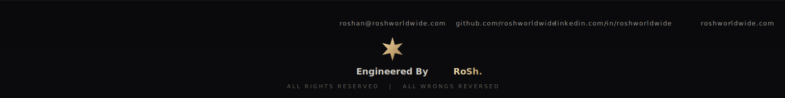

<p align="center"><code>roshan@roshworldwide.com</code> · <code>linkedin.com/in/roshworldwide</code> · <code>x.com/roshworldwide</code> · <code>roshworldwide.com</code></p>


### // SITREP




### // OPERATING LOOP

<p align="center">Find the problem. Invent the fix. Ship to production. File the patent. Repeat.</p>


### // SYSTEMS

<h3 align="center"><a href="https://github.com/roshworldwide/acoustic-ams">ACOUSTIC AMS</a></h3>
<p align="center">Attendance authentication an entire university runs on. Sound cannot be spoofed from a hostel room.</p>
<p align="center"><sub><code>99.9% UPTIME · &lt;50MS · 20 PATENT FILINGS · SCALING 1→5 CAMPUSES &nbsp;&nbsp; → github.com/roshworldwide/acoustic-ams</code></sub></p>


<h3 align="center"><a href="https://github.com/roshworldwide/onprem-sre-engine">ON-PREM SRE ENGINE</a></h3>
<p align="center">A 14B-parameter model that diagnoses servers and writes its own remediation. Nothing leaves the machine.</p>
<p align="center"><sub><code>0 BYTES OUTBOUND · &lt;800MS REMEDIATION · 4-BIT MLX &nbsp;&nbsp; → github.com/roshworldwide/onprem-sre-engine</code></sub></p>


<h3 align="center"><a href="https://github.com/roshworldwide/quant-lens">QUANT-LENS</a></h3>
<p align="center">4,450,146 rows. 160 days walked forward. The pipeline earns its numbers.</p>
<p align="center"><sub><code>54.7% PEAK WIN RATE · 175 OPTUNA TRIALS · SHAP-PRUNED 36→30 &nbsp;&nbsp; → github.com/roshworldwide/quant-lens</code></sub></p>


<h3 align="center"><a href="https://github.com/roshworldwide/finance-os">FINANCE OS</a></h3>
<p align="center">Money, predicted instead of recorded. Ninety days forward at 120 frames per second.</p>
<p align="center"><sub><code>NATIVE MACOS · METAL · 90-DAY HORIZON &nbsp;&nbsp; → github.com/roshworldwide/finance-os</code></sub></p>


### // INSTRUMENTS

```
intelligence   pytorch · mlx · transformers · lora · 4-bit quantization · catboost · xgboost · lightgbm · shap · optuna
systems        kubernetes · docker · postgres · supabase · node · vercel · air-gapped deployment
interface      swift · swiftui · metal · react · next.js · typescript
discipline     python · c/c++ · sql · bash · git
```


### // TELEMETRY

<p align="center">
  
</p>

<p align="center">
  
</p>


