<p align="center"><code>roshan@roshworldwide.com</code> · <code>linkedin.com/in/roshworldwide</code> · <code>x.com/roshworldwide</code> · <code>roshworldwide.com</code></p>


### // SITREP


### // OPERATING LOOP

<p align="center">Find the problem. Invent the fix. Ship to production. File the patent. Repeat.</p>


### // SYSTEMS

<a href="https://github.com/roshworldwide/acoustic-ams"></a>
<a href="https://github.com/roshworldwide/onprem-sre-engine"></a>
<a href="https://github.com/roshworldwide/quant-lens"></a>
<a href="https://github.com/roshworldwide/finance-os"></a>


### // INSTRUMENTS

```
intelligence   pytorch · mlx · transformers · lora · 4-bit quantization · catboost · xgboost · lightgbm · shap · optuna
systems        kubernetes · docker · postgres · supabase · node · vercel · air-gapped deployment
interface      swift · swiftui · metal · react · next.js · typescript
discipline     python · c/c++ · sql · bash · git
```


### // TELEMETRY



<p align="center">
  
</p>


