<!-- ============================================================
     Roshan Raj — GitHub profile README (roshworldwide/roshworldwide)
     Liquid-Glass banners are rendered PNGs (see /assets + *.html sources).
     Everything else is GitHub-native Markdown so links stay live.
     ============================================================ -->

  <picture>
    <source media="(prefers-color-scheme: dark)"  srcset="assets/header-dark.svg">
    <source media="(prefers-color-scheme: light)" srcset="assets/header-light.svg">
    
  </picture>

  
  
  
  
  

## ⚙️ Flagship work

Systems built from first principles — storage engines, inference runtimes, and formally-verified infrastructure, written mostly in Rust and benchmarked against real baselines.

**[Engram](https://github.com/roshworldwide/engram)** &nbsp;·&nbsp; AI-Agent Memory Storage Engine
Four native memory types, bitemporal time-travel, and a causal-provenance DAG on a custom copy-on-write B-tree + WAL (MVCC).
`330K durable writes/s` `165× faster time-travel vs Postgres` `93% coverage` `4 fuzz targets × 10M runs`
**Rust** · COW B-tree · WAL/MVCC · PyO3 SDK · VLDB-style paper draft

**[Crucible](https://github.com/roshworldwide/crucible)** &nbsp;·&nbsp; Air-Gapped Multi-Tenant LLM Inference Runtime
A hand-written transformer stack across 13 crates — attention, paged KV cache, continuous batching, speculative decoding. Zero PyTorch / BLAS / Python (CI-enforced).
`13 crates` `NEON GEMM ~3× scalar` `Metal kernels` `AES-256 per-tenant isolation`
**Rust** · NEON SIMD · Metal · paged KV cache · property-tested non-interference

**[Axiom](https://github.com/roshworldwide/axiom)** &nbsp;·&nbsp; Formally-Verified CRDT Runtime
TLA+ specs for four CRDTs model-checked across 142M+ states, plus two machine-checked TLAPS proofs. Rust bound to specs via refinement mappings & trace replay.
`142M+ states checked` `2 TLAPS proofs` `4 CRDTs` `anti-replay freshness proven`
**TLA+ / TLAPS** · Rust · refinement mappings · trace replay

**[Holdout](https://github.com/roshworldwide/holdout)** &nbsp;·&nbsp; LLM Evaluation Framework &nbsp;`open source`
A CI regression gate with statistical rigor: BCa bootstrap CIs, McNemar / permutation tests, Benjamini–Hochberg correction, power / MDE, and leakage detection.
`4 backends` `fully offline` `1,000+ cases/run` `~6 µs overhead`
**Python** · pytest plugin · GitHub Action · OpenAI · Anthropic · Ollama · Apple MLX

**On-Premise SRE Engine** &nbsp;·&nbsp; Autonomous air-gapped incident response
Runs a 14B-parameter 4-bit LLM fully air-gapped — 0 bytes outbound. A digital-twin sandbox detects microservice anomalies and auto-generates Kubernetes / Bash remediations in under 800 ms, while a 120 fps GPU frontend tracks $10K+/min outage burn.
`14B params · 4-bit` `0 bytes outbound` `<800 ms remediation` `120 fps GPU frontend`
Air-gapped LLM · digital-twin sandbox · Kubernetes · GPU rendering

## ⚡ Live demos

Two shipped products, both running live on GitHub Pages:

- **Sahayak** — an offline, vernacular AI fraud-shield for Bharat. → **[Try it live ↗](https://roshworldwide.github.io/optum-v2/)**
- **Pramaan** — verifiable carbon MRV; watch a tampered reading get rejected. → **[Try it live ↗](https://roshworldwide.github.io/optum-v3/)**

## 📜 7 patents pending

Novel systems spanning authentication, collaboration, privacy, and human–computer interaction.

`01` Acoustic Proximity Authentication &nbsp;·&nbsp; `02` Negative-Latency Collaborative Editing &nbsp;·&nbsp; `03` Semantic Clipboard &nbsp;·&nbsp; `04` Privacy-Preserving Crash Reproduction &nbsp;·&nbsp; `05` On-Device Pre-Update Regression Certification &nbsp;·&nbsp; `06` Unified Fidelity-Budget Scheduler &nbsp;·&nbsp; `07` Dynamically Morphing Ergonomic Keyboard

## 🧭 Experience

**Co-Founder & Lead Engineer** &nbsp;·&nbsp; Bastian Build &nbsp;·&nbsp; Jan – Apr 2026
Invented **Acoustic AMS**, a campus-wide attendance system on an acoustic-handshake protocol that defeats GPS / Bluetooth relay & spoofing — sub-50 ms verify, 99.9% uptime for 5,000+ students, scaling B2B to 4–5 campuses. Ran a zero-downtime migration of 31 Postgres tables to a serverless Supabase / Vercel stack.

**Data Analyst Intern** &nbsp;·&nbsp; Convin.ai &nbsp;·&nbsp; 2026
Built the live analytics platform quantifying **₹5.5 Cr+/day** recovered in a client bank's collections; rebuilt the audit workflow as a dedicated app (~10× faster, 4,000–6,000 audits/month). Both adopted company-wide.

**Software Engineering Intern · AI FinTech** &nbsp;·&nbsp; Lenn Chartered &nbsp;·&nbsp; Mar – May 2026
Fine-tuned a domain FinTech LLM into a production advisor (query-resolution **−90%** with regulatory accuracy); built a low-latency synthetic paper-trading engine for 5,000+ concurrent users.

**Full-Stack Developer** &nbsp;·&nbsp; OxyHarvest &nbsp;·&nbsp; Dec 2025 – Feb 2026
Shipped the live impact platform streaming real-time CO₂ telemetry from 90+ deployed purifiers via Xano APIs, plus the field apps used by 30 technicians.

## 🧠 Toolbox

**Languages** &nbsp;
       

**ML & LLMs** &nbsp;
      

**Systems & Infra** &nbsp;
         

**Low-level & Performance** &nbsp;
     

**Formal methods & CI** &nbsp;
      

## 🏆 Awards

- 🥇 **Flinders AI Hackathon** — Top 5 Finalist, of 1,000+ engineers
- 🥉 **Hackbricks by Databricks** — 2nd Runner-Up

## 🎓 About

First principles, then production. I build infrastructure from the ground up — storage engines, inference runtimes, and formally-verified protocols — and ship it to real users. Currently a B.Tech Computer Science student at **Manipal Institute of Technology** (GPA 8.28/10, Aug 2023 – Aug 2027), with research at the Manipal Innovation Cell. My work lives at the intersection of low-level performance, applied AI, and mathematical rigor — NEON kernels and Metal shaders on one end, TLA+ proofs and bootstrap statistics on the other.

## 📫 Let's build something that ships

**[roshan@roshworldwide.com](mailto:roshan@roshworldwide.com)** &nbsp;·&nbsp; [Portfolio](https://roshworldwide.com) &nbsp;·&nbsp; [LinkedIn](https://www.linkedin.com/in/roshworldwide) &nbsp;·&nbsp; [GitHub](https://github.com/roshworldwide) &nbsp;·&nbsp; Bengaluru, India

Open to senior & infrastructure roles.
